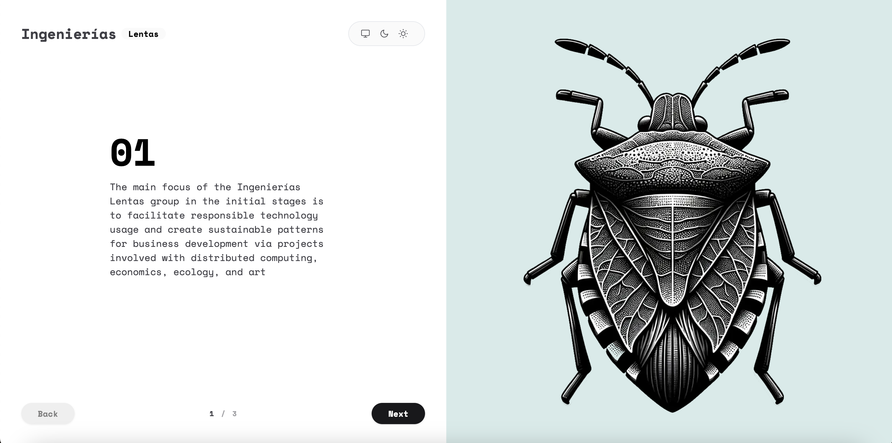

<p align="center">
  
</p>

<p align="center">
  
  </a>
</p>

[](https://vercel.com/new/clone?repository-url=https%3A%2F%2Fgithub.com%2Flucky-chap%2Fkaminari&demo-title=Kaminari&demo-description=Next.js%2C%20TailwindCSS%20and%20shadcn-ui%20Starter%20Template&demo-url=https%3A%2F%2Fkaminari.vercel.app&demo-image=https%3A%2F%2Fkaminari.vercel.app%2Fog.png)

## Features 💅

- **Next.js 14** - Duh
- **Tailwind CSS 3** - A utility-first CSS framework
- **shadcn-ui** - An awesome component library
- **TypeScript** - JavaScript superset
- **ESLint** — Pluggable JavaScript linter
- **Prettier** - Opinionated
- **Jest** - The delightful JavaScript Testing Framework (coming soon)
- **Absolute import** - Import folders and files using the `@` prefix
- **Quick deploy** - Quickly deploy with the `Vercel Deploy button below`

## Getting started 🚀

The best way to start with this template is using `create-next-app`.

```
npx create-next-app my-app -e https://github.com/lucky-chap/kaminari
```

If you prefer you can clone this repository and run the following commands inside the project folder:

1. `npm install` or `yarn`;
2. `yarn dev`;

To view the project open `http://localhost:3000`.

## 📝 License

This project is licensed under the MIT License - see the [LICENSE](LICENSE) file for more information.

---